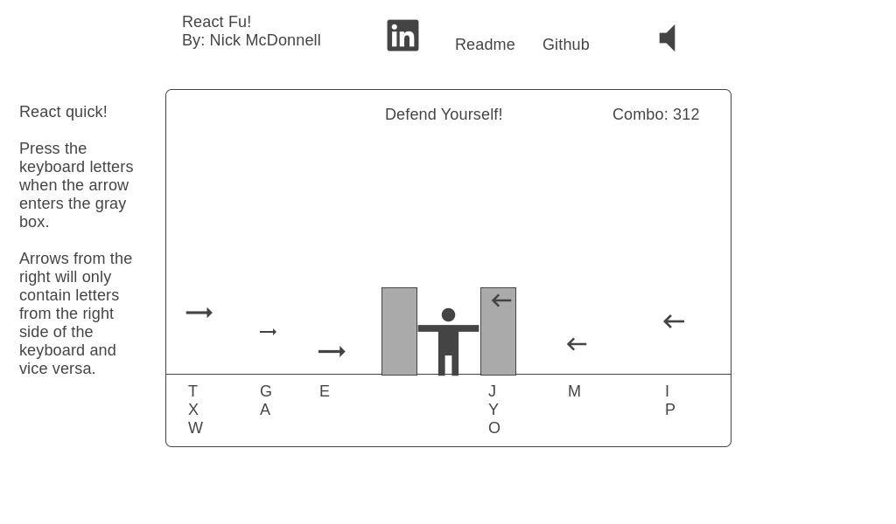

# React_Fu

## Overview

* React Fu will be a relative clone of the [One Finger Death Punch](https://youtu.be/R1j0VE6d-xE?t=7)

* My App will allow a player to defend theirself against projectiles from both sides. Specific keys on a keyboard must be pressed at a specific time to destroy incoming projectiles.

### MVPS
1. General layout with central character
2. Projectiles, Randomness and origin from both sides
3. Destruction of Projectiles given response.
4. Visual display of different projectiles and background
5. Fight music implementation
Bonus: Response movement of the central character 

### Technologies, Libraries, APIs

How will you architect the game? Will it use vanilla JS, HTML, and CSS or will you use a library like three.js? Will you use any other libraries or API's? Summarize the technical challenges you anticipate and how you plan to solve them.

### Wireframes

### Implementation Timeline

